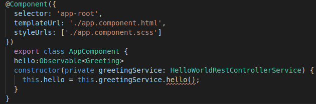
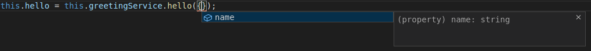

# ng-swagger-gen-example

In einem aktuellen Projekt verwenden wir ng-swagger-gen und ng-openapi-gen um Modellschnittstellen und Web-Service-Clients aus unserer Swagger-2.0- und OpenAPI-3-Spezifikation zu generieren. In diesem Artikel soll anhand eines kleinen Beispiels deren Verwendung gezeigt werden. Das Beispiel Projekt kann auf [Github](https://github.com/thomcz/ng-swagger-gen-example) eingesehen werden.

# Motivation
In unserem Projekt setzt sich unser Backend aus mehreren SpringBoot-Anwendungen zusammen. Außerdem haben wir ein Angular-Frontend, das mit diesen Anwendungen kommuniziert. Zu beginn haben wir unser Backend mithilfe des Angular-HttpClient aufgerufen:

```
import { HttpClient } from '@angular/common/http';
...
constructor(private httpClient: HttpClient) { ... }
...
getSomeData() {
    return this.httpClient.get(`https://someapi.org/v2/getSomeData?input=someInput`);
}
...
```

Diese Aufrufe haben aber immer wieder zu Laufzeitfehlern geführt, wenn wir das Backend geändert oder erweitert haben, aber vergessen haben, das Frontend anzupassen. Um den Kunden ein beseres Erlebnis bieten zu können und um auch uns das Leben zu vereinfachen wollten wir an dieser Stelle mehr Typsicherheit und Kompilierfehler anstatt Laufzeitfehler.

# Die Idee
Nach kurzer Recherche fanden wir [ng-swagger-gen](https://github.com/cyclosproject/ng-swagger-gen) und [ng-openapi-gen](https://github.com/cyclosproject/ng-openapi-gen) die uns Abhilfe versprachen. Unsere Idee war, dass wir diese Generierung in unserem Build-Prozess einbauen, um schon beim Build Kompilierfehler zu bekommen, wenn sich unser Backend ändert und wir gezwungen werden das Frontend anzupassen. Da sich unser Backend aus mehreren Anwendungen zusammensetzt und sowohl Swagger-2.0- und OpenAPI-3-Spezifikation von ihnen verwendet werden, war uns auch wichtig, dass wir beide Generatoren zusammen verwenden können. Nachdem wir einen der Generatoren ausprobiert haben und erfolgreich in den Buildprozess einer Anwendung einbinden konnten, entschieden wir uns auch die anderen Anwendungen anzupassen und konnten unser Ziel erreichen.

# Implementierung
Da wir mit unsere aktuellen Implementierung sehr zufrieden sind, soll im Folgenden eine kleine Demo unserers Ansatzes vorgestellt werden. Für das Beispel nutzen wir ein SpringBoot-Backend in Kotlin geschrieben und ein Angular-Frontend. Außerdem wird Springdoc-Openapi für die OpenAPI-3-Spezifikation verwendet und zur Generierung ```ng-openapi-gen```.

## Das Backend
Wie in jeder guten Demo wollen wir an dieser Stelle auch ein HelloWorld Beispiel verwenden. Das Backend bietet einen HelloWorkd-Endpunkt an, der auf Anfrage  ein ```HelloWorld!``` zurückliefert:
```
data class Greeting(val content: String)

@GetMapping("/api/hello", produces = [MediaType.APPLICATION_JSON_VALUE])
    fun hello(): Greeting = Greeting("Hello World!")
```
Um eine OpenApi-Spezifikation zu generieren, reicht es in die ```gradle.build``` oder ```pom.xml```, ```springdoc-openapi-ui``` als Abhängigkeit mit aufzunehmen.
Mehr gibt es zum Backend nicht zu sagen.

## Das Frontend
Um nochmal den Unterschied zu unserer früheren Implementierung aufzuzeigen, soll an dieser Stelle gezeigt werden wie wir den Endpunkt mithilfe des HttpClient aufrufen können:
```
hello:Observable<Object>
constructor(private httpClient: HttpClient) { 
    this.hello = this.httpClient.get(`http://localhost:8080/api/hello`);
}
```
im HTML zeigen wir den Inhalt des Observables an:
```
{{(hello|async)|json}}
```
Da dieser Ansatz zu den bereits erwähnten Problemen geführt hat, soll nun mithilfe von ```ng-openapi-gen``` eine Schnittstelle zum Backend generiert werden.

Dazu müssen wir zunächst das Paket installieren:
```
npm i ng-openapi-gen
```

und legen im ```package.json``` einen Task an:

```
{
    ...
    "scripts": {
        "ng-openapi-gen": "ng-openapi-gen",
        ...
    }
}
```
Jetzt muss der Pfad für die Spezifikation angeben werden. Dazu muss im Hauptverzeichnis eine ```ng-openapi-gen.json``` angelegt werden, mit folgenden Inhalt:
```
{
    "$schema": "node_modules/ng-openapi-gen/ng-openapi-gen-schema.json",
    "input": "http://localhost:8080/v3/api-docs",
    "output": "src/generated-backend",
    "ignoreUnusedModels": false
  }
```
Wenn wir jetzt unser Backend laufen lassen und den ```ng-openapi-gen.json``` Task laufen lassen wird in den Ordner ```src/generated-backend``` unsere Backend-Schnittstelle generiert. Um die generierte Schnittstelle verwenden zu können muss in der ```app.module.ts``` das ```ApiModul``` eingebunden werden:
```

@NgModule({
  declarations: [
    ...
  ],
  imports: [
    ...
    ApiModule
  ],
  ...
})
export class AppModule { }
```
Jetzt können wir die generierte Schnittstelle in unserer Komponente verwenden:

```
hello: Observable<Greeting>
constructor(private greetingService: HelloWorldRestControllerService) { 
   this.hello = this.greetingService.hello();
}
```
was direkt auffällt, ist, dass wir einen konkreten Typ für das Observable angeben können, anstatt wie zuvor ein Object.

# Änderungen
Um jetzt zu zeigen, dass sich der Aufwand gelohnt hat, ändern wir das Backend. Dazu fügen wir einen Parameter zum Aufruf des Hello-World-Endpunktes hinzu:
```
GetMapping("/api/hello", produces = [MediaType.APPLICATION_JSON_VALUE])
    fun hello(@RequestParam name: String): Greeting = Greeting("Hello $name!")
```
Wenn wir jetzt unser Frontend starten und aufrufen, erhalten wir in beiden Fällen einen BadRequest:
```
{
    status":400,
    "error":"Bad Request","
    trace":"...",
    "message":"Required String parameter 'name' is not present","path":"/api/hello"
}
```
Lassen wir aber vor dem Starten des Frontends den ```ng-openapi-gen```-Task laufen, bekommen wir einen Kompilierfehler: 



Also fügen wir den Parameter hinzu:
```
this.hello = this.greetingService.hello({
    name: 'Thomas'
});
```
IntelliJ und VSCode bieten an dieser Stelle sogar eine Auto-Vervollständigung für die fehlenden Parameter an:



Wenn wir jetzt das Frontend starten erhalten wir eine korrekte Ausgabe:
```
{ "content": "Hello Thomas!" }
```

# Abschließende Worte
Die hier gezeigt Implementierung zeigt nur die Grundlagen und kann weiter ausgebaut werden.
In unserem Projekt haben wir den Input der Spezifikation abhängig davon gemacht, auf welcher Umgebung der Build läuft. Lokal wurde sie aus dem laufenden Backend und auf dem Buildserver aus einem Git-Repository heruntergeladen. Außerdem wurde der ng-openapi-gen Task in den Build Task aufgenommen und läuft vor unseren Angular-Tests. So haben wir unser Ziel ereichen können und Änderungen am Backend führen schon während dem Build zu Kompilier- und nicht erst zu Laufzeitfehlern.

# Part 2 
SwaggernIntTest
Integration in Build Prozess
